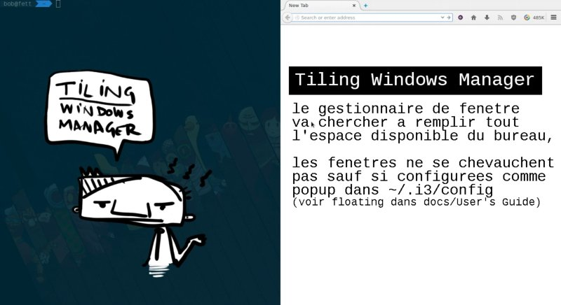
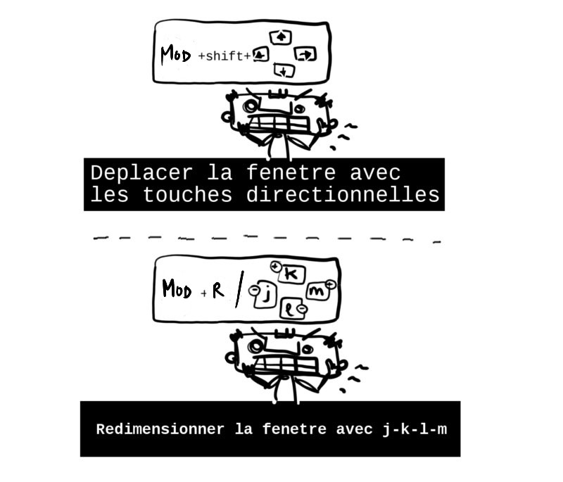

# i3 WM (Windows Manager)

i3, le gestionnaire de fenetre minimaliste: http://i3wm.org/

### Installation

Sous debian, ubuntu, mint:

	$ sudo aptitude install i3

ou installez simplement le paquet dans dans votre gestionnaire habituel.

### Configuration

- deloguez vous puis au login, choisissez le menu options (en general une icone de "rouage"). 
- choisissez une session i3

**Premiere configuration**: si vous n'avez aucun fichier de config predefini, un popup apparait, validez en appuyant entree, le fichier `~/.i3/config` est cree. 

**Modifier:** Il faut ensuite choisir votre touche mod (modifier) entre la touche windows et alt (touche windows recommandee, elle ne sert a rien sinon).

### Presentation

* Plus d'infos sur les Tiling window manager: https://en.wikipedia.org/wiki/Tiling_window_manager

* Floating, documentation: http://i3wm.org/docs/userguide.html#_floating
* Floating, syntaxe (a utiliser dans `~/.i3/config`):

		 `for_window [class="Xfce4-notifyd"] floating enable; border none; focus mode_toggle` 
		

### Raccourcis

Toujours dans `~/.i3/config` ; il est possible d'ajouter ses propres raccourcis (voir dans le fichier config, si la lettre n'est pas deja allouee).

Syntaxe (exemple): `bindsym $mod+d exec dmenu_run`

Dans notre cas, le modifier (mod) correspond a la touche windows:

Raccourcis | Fonctions
--- | ---
mod+d | dmenu
mod+shift+e | se deloguer 
mod+shift+r | recharger la page (utile apres edition de la config)
mod+1 2 3 4 | changer de bureau
mod+f | plein ecran (mod+f a nouveau pour sortir du mode plein ecran)
mod+entree | shell
mod+v ou h | regler le spawn des fenetres
mod + shift + touche directionnelle | deplacer la fenetre selectionnee
mod+r hjkl | redimensionner la fenetre (escape pour sortir)

### Ajouts utiles a la config de base

Lancer des programmes au demarrage de i3.
Il suffit d'editer `~/.i3/config` ; ajouter une commande avec "exec".

		exec --no-startup-id xfce4-power-manager
		exec --no-startup-id gnome-screensaver
### Liens

- Site officiel: http://i3wm.org/ 
- Documentation: http://i3wm.org/docs/
- FAQ + Subreddit: https://www.reddit.com/r/i3wm/
- Idees de config + theme (dotfiles): https://www.reddit.com/r/unixporn
