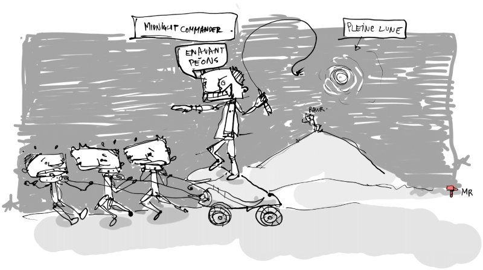

# Midnight Commander (mc)                

Couteau suisse du terminal, souvent installe de base sur les servers webs.

### Gestionnaire de fichiers

* lance les fichiers connus avec **entree**
* utilisation du shell (directe, ou avec **ctrl+o**)
* Double fenetre: depart arrivee, passage d'une fenetre a l'autre avec **tab**
* Touches F1-F10

		F3 viewer
		F4 edition du fichier
		F5 copie
		F6 deplace	
		F7 nouveau repertoire
		F8 efface

* possibilite d'interagir sur les fichiers avec une selection (pave numerique **+ -**)

### Recherche de fichiers: alt+?

et utilisation des resultats:

* F3, F4
* Entree pour se placer sur le fichier
* Recuperation de la liste (possibilite de copier, deplacer, effacer)

### Creation / manipulation d'archives: F2

* possibilite de naviguer dans ces archives (visualisation, copie)
* possibilite (si le format le permet, ex: zip): edition, suppression, insertion

### Client FTP

* cd ftp://ftp.debian.org/debian/
* manipulations de fichiers
* F3 ; F4 si l'utilisateur a les droits
* systeme de bookmark avec **ctrl+\**

### Comparaison de repertoire

* ctrl+x d

Raccourcis utiles / notes

* alt+o
* support souris

---
Illustration: [image](https://raw.githubusercontent.com/marteaurouge/la-gribouille-du-jour/master/2016/2016-03-22_midnight-commander.jpg) | [video](https://www.youtube.com/watch?v=rCY6hDJ3BB4)
